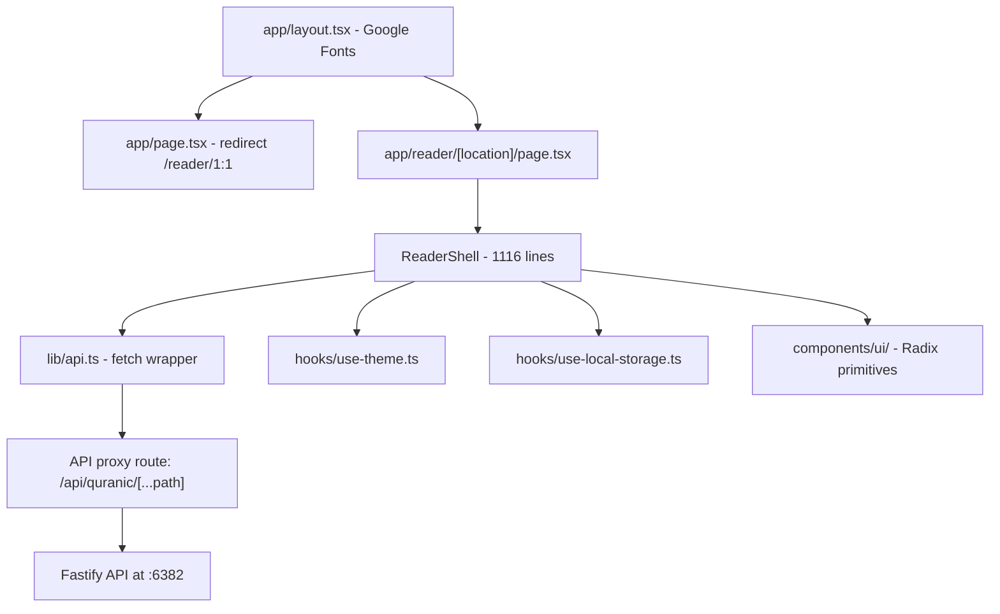

# Code Review: Frontend Port — React CRA → Next.js 16

## Architecture Overview

## What Went Well ✅

| Area | Details |
|------|---------|
| **App Router adoption** | Proper use of Next.js App Router with dynamic segment `[location]`, server components where possible, `"use client"` only where needed |
| **API proxy** | Catch-all proxy at `/api/quranic/[...path]`. Handles URL normalization, path encoding, and upstream errors with proper `502` status. `force-dynamic` is correct for API proxy |
| **Custom hooks** | Both `useTheme` and `useLocalStorage` use `useSyncExternalStore` for SSR safety — this is the correct React 19 pattern. Cross-tab sync via `storage` events is a nice touch |
| **Dark mode** | Flash-free via inline `<script>` in layout. Uses `localStorage` + `prefers-color-scheme` fallback + class-based toggle |
| **Infinite scroll** | `IntersectionObserver` with `rootMargin: "360px"` for pre-loading. Session ID tracking prevents stale updates from concurrent fetches |
| **UI component layer** | 11 Radix-based shadcn primitives, clean separation between domain component (`ReaderShell`) and UI kit |
| **Tailwind theming** | HSL-based custom design tokens in `globals.css` with warm gold accent (hsl `36 95% 45%`). Both light and dark palettes are well-curated |
| **TypeScript types** | Clean `types.ts` matching API response shapes. `location.ts` with type guard `isTokenLocation()` |
| **User preferences** | Translation selection, POS filters, phonetic toggle, compact mode — all persisted in `localStorage` via the custom hook |

## Observations & Suggestions 📝

1. **ReaderShell size** — At 1,116 lines in a single component, `reader-shell.tsx` is doing a lot: navigation, data fetching, filtering, rendering verses, token analysis panel. Consider extracting:
   - `ReaderHeader` — chapter/verse selects, translation/POS toggles, search
   - `VerseList` — the verse rendering + infinite scroll logic
   - `TokenAnalysisPane` — the sidebar with summary/segments/grammar tabs
   - Custom hooks like `useReaderData()` and `useTokenAnalysis()`

2. **`cache: "no-store"` on client** — In `lib/api.ts`, `fetch` with `cache: "no-store"` is used on the client side. Since this goes through Next.js API routes first, the browser fetch doesn't need this option. It's harmless but misleading.

3. **Missing error boundary** — No React error boundary wrapping the reader. An unhandled error in rendering will blank the page. Consider adding an `error.tsx` in `app/reader/[location]/`.

4. **No loading UI for initial page** — The `page.tsx` is a server component that awaits `params` then renders `ReaderShell`. There's no `loading.tsx` for the route suspense boundary.

5. **Legacy `src/` and `config/` still present** — The `tsconfig.json` explicitly excludes `src`, `config`, and `scripts`. These directories contain the old CRA/Webpack-based code (19 subdirectories, webpack configs, jest configs). Consider removing or archiving them to avoid confusion.

6. **Two env vars for the same thing** — `.env.example` has both `QURANIC_API_BASE` and `NEXT_PUBLIC_QURANIC_API_BASE`. The proxy route only needs the server-side one. The `NEXT_PUBLIC_` variant would expose the API URL to the client bundle, which isn't needed since all calls go through the proxy.

7. **No tests** — The frontend has zero test files. Consider at minimum: API proxy route unit tests and component tests for the reader shell.

## Grade: **A-**

The CRA → Next.js migration is very solid. The App Router patterns are correctly applied, the API proxy architecture is clean, and the custom hooks demonstrate strong React fundamentals. The main drag is the monolithic `ReaderShell` component and the absence of tests. The design system is polished with thoughtful dark mode implementation.

## Priority Improvements

| Priority | Item | Effort |
|----------|------|--------|
| 🔴 High | Split `ReaderShell` into smaller components | Medium |
| 🔴 High | Remove legacy `src/`, `config/`, `scripts/` directories | Low |
| 🟡 Medium | Add `error.tsx` and `loading.tsx` to reader route | Low |
| 🟡 Medium | Add frontend tests | Medium |
| 🟢 Low | Remove duplicate `NEXT_PUBLIC_` env var | Low |
